# Ray Tracing In One Weekend

Rray Tracing Series by Peter Shirley

[toc]

# 1. 概览
这些年来我教过很多图形课。我经常在光线追踪中这样做，因为你被迫编写所有代码，但你仍然可以在没有 API 的情况下获得很酷的图像。

我决定将我的课程笔记改编成一个操作方法，让你尽快进入一个很酷的程序。它不会是功能齐全的光线追踪器，但它确实具有间接照明，这使光线追踪成为电影中的主要内容。遵循这些步骤，如果您兴奋并想要追求它，您生产的光线追踪器的架构将有利于扩展到更广泛的光线追踪器。

当有人说“光线追踪”时，它可能意味着很多事情。我要描述的是技术上的路径跟踪器，而且是一个相当通用的跟踪器。虽然代码会非常简单（让计算机来完成工作！）但我认为您会对您制作的图像感到非常满意。

我将按照我编写的顺序向您介绍如何编写光线追踪器，以及一些调试技巧。到最后，您将拥有一个可以生成一些出色图像的光线追踪器。您应该可以在周末完成此操作。如果您需要更长的时间，请不要担心。我使用 C++ 作为驱动语言，但你不需要。但是，我建议您这样做，因为它速度快、便携，而且大多数制作电影和视频游戏渲染器都是用 C++ 编写的。请注意，我避免了 C++ 的大多数“现代特性”，但是继承和运算符重载对于光线追踪器来说太有用了，无法传递。我没有在线提供代码，但代码是真实的，除了 vec3 类中的几个简单运算符外，我展示了所有代码。我非常相信通过输入代码来学习它，但是当代码可用时我会使用它，所以我只在代码不可用时练习我所宣扬的内容。

所以不要问！我留下了最后一部分，因为我做的 180 度很有趣。一些读者最终遇到了细微的错误，这些错误在我们比较代码时得到了帮助。所以请输入代码，但如果你想查看我的代码，它位于
https://github.com/RayTracing/raytracing.github.io/

我假设读者对向量有一点熟悉（比如点积和向量加法）。如果您不知道，请进行一定的复习。如果您需要复习，或者第一次学习它，请查看 Marschner 和我的图形书籍，Foley、Van Dam 等，或 McGuire 的图形法典。

如果你遇到了麻烦，或者做了一些很酷的事情，你想让别人看看，给我发电子邮件：[ptrshrl@gmail.com](ptrshrl@gmail.com).


我将维护一个与本书相关的网站，包括进一步阅读和博客资源链接。
https://in1weekend.blogspot.com/

感谢所有帮助这个项目的人。您可以在这本书的结尾。

让我们继续吧！


# 2. 输出PPM格式的图片

## 2.1. PPM 格式图片
无论何时启动渲染器，都需要一种查看图像的方法。最直接的方法是将其写入文件。问题是，格式太多了。其中许多是复杂的。我总是从纯文本ppm文件开始。下面是维基百科关于PPM的一个很好的描述：

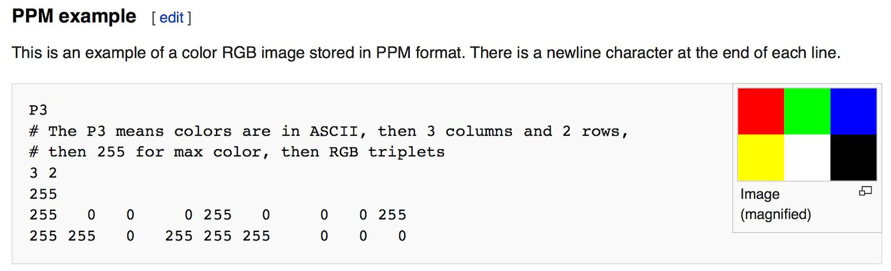  


让我们制作一些C++代码来输出这样的东西
```cpp
#include <iostream>

int main() {
    // Image
    const int image_width = 256;
    const int image_height = 256;
    // Render.
    std::cout << "P3\n" << image_width << ' ' << image_height << "\n255\n";
    for (int j = image_height-1; j >= 0; --j) {
        for (int i = 0; i < image_width; ++i) {
            auto r = double(i) / (image_width-1);
            auto g = double(j) / (image_height-1);
            auto b = 0.25;
            int ir = static_cast<int>(255.999 * r);
            int ig = static_cast<int>(255.999 * g);
            int ib = static_cast<int>(255.999 * b);
            std::cout << ir << ' ' << ig << ' ' << ib << '\n';
        }
    }
}
 ```
该代码中需要注意一些事项：
1. 像素按从左到右的像素行写出。
2. 从上到下写出行。
3. 按照惯例，每个红色/绿色/蓝色分量的范围从0.0到1.0。稍后我们将对此进行放宽当我们在内部使用高动态范围时，但在输出前，我们将色调映射到0到1范围，因此此代码不会更改。
4. 从左到右，红色从完全关闭（黑色）变为完全打开（鲜红色），绿色从黑色变为黑色从底部到顶部完全打开。红色和绿色一起变成黄色，所以我们应该期待鞋面右角为黄色


## 2.2. 创建图像文件
由于文件被写入程序输出，因此需要将其重定向到图像文件。通常，这是通过使用>重定向运算符从命令行完成的，如下所示：

```c
build\Release\inOneWeekend.exe > image.ppm
```
在Mac或者Linux下可能是这样的：
```c
build/inOneWeekend.exe > image.ppm
```

使用PPM图片阅读器打开来预览图片信息。（这里推荐在线软件）


## 2.3. 添加进度指示器
在继续之前，让我们在输出中添加一个进度指示器。这是跟踪长渲染进度的便捷方法，也可以识别由于无限循环或其他问题而暂停的运行。

我们的程序将图像输出到标准输出流（std::cout），所以不要管它，而是写到错误输出流（std::cerr）

```cpp
    for (int j = image_height-1; j >= 0; --j) {
        //std::cerr << "\rScanlines remaining: " << j << ' ' << std::flush;
        for (int i = 0; i < image_width; ++i) {
            auto r = double(i) / (image_width-1);
            auto g = double(j) / (image_height-1);
            auto b = 0.25;

            int ir = static_cast<int>(255.999 * r);
            int ig = static_cast<int>(255.999 * g);
            int ib = static_cast<int>(255.999 * b);

            std::cout << ir << ' ' << ig << ' ' << ib << '\n';
        }
    }

    //std::cerr << "\nDone.\n";
```
> Main render loop with progress reporting

# 3. 三维向量类
几乎所有的图形程序都有一些用于存储几何向量和颜色的类。在许多系统中，这些矢量是4D的（3D加上一个同质坐标表示几何，RGB加上一个alpha透明通道表示颜色）。对于我们的目的，三个坐标就足够了。我们将使用相同的vec3类来表示颜色、位置、方向、偏移量，等等。

有些人不喜欢这样做，因为它不能防止你做一些愚蠢的事情，比如给一个位置添加颜色。他们说得很有道理，但在不明显错误的情况下，我们总是要走 "减少代码 "的路线。尽管这样，我们还是为vec3声明了两个别名：point3和color。

因为这两个类型只是vec3的别名，所以如果你向一个参数为point3的函数传递颜色，你不会得到警告。我们使用它们只是为了澄清意图和用途。

## 3.1. 变量和方法

这是我的vec3类的顶部部分。

```cpp
#ifndef VEC3_H
#define VEC3_H

#include <cmath>
#include <iostream>

using std::sqrt;

class vec3 {
    public:
        vec3() : e{0,0,0} {}
        vec3(double e0, double e1, double e2) : e{e0, e1, e2} {}

        double x() const { return e[0]; }
        double y() const { return e[1]; }
        double z() const { return e[2]; }

        vec3 operator-() const { return vec3(-e[0], -e[1], -e[2]); }
        double operator[](int i) const { return e[i]; }
        double& operator[](int i) { return e[i]; }

        vec3& operator+=(const vec3 &v) {
            e[0] += v.e[0];
            e[1] += v.e[1];
            e[2] += v.e[2];
            return *this;
        }

        vec3& operator*=(const double t) {
            e[0] *= t;
            e[1] *= t;
            e[2] *= t;
            return *this;
        }

        vec3& operator/=(const double t) {
            return *this *= 1/t;
        }

        double length() const {
            return sqrt(length_squared());
        }

        double length_squared() const {
            return e[0]*e[0] + e[1]*e[1] + e[2]*e[2];
        }

    public:
        double e[3];
};

// Type aliases for vec3
using point3 = vec3;   // 3D point
using color = vec3;    // RGB color

#endif

```

我们在这里使用double，但有些射线追踪器使用float。任何一种都可以--按照你自己的口味。

## 3.2. vec3 的实用方法
头文件的第二部分包含vector向量实用函数。
```cpp
// vec3 Utility Functions

inline std::ostream& operator<<(std::ostream &out, const vec3 &v) {
    return out << v.e[0] << ' ' << v.e[1] << ' ' << v.e[2];
}

inline vec3 operator+(const vec3 &u, const vec3 &v) {
    return vec3(u.e[0] + v.e[0], u.e[1] + v.e[1], u.e[2] + v.e[2]);
}

inline vec3 operator-(const vec3 &u, const vec3 &v) {
    return vec3(u.e[0] - v.e[0], u.e[1] - v.e[1], u.e[2] - v.e[2]);
}

inline vec3 operator*(const vec3 &u, const vec3 &v) {
    return vec3(u.e[0] * v.e[0], u.e[1] * v.e[1], u.e[2] * v.e[2]);
}

inline vec3 operator*(double t, const vec3 &v) {
    return vec3(t*v.e[0], t*v.e[1], t*v.e[2]);
}

inline vec3 operator*(const vec3 &v, double t) {
    return t * v;
}

inline vec3 operator/(vec3 v, double t) {
    return (1/t) * v;
}

inline double dot(const vec3 &u, const vec3 &v) {
    return u.e[0] * v.e[0]
         + u.e[1] * v.e[1]
         + u.e[2] * v.e[2];
}

inline vec3 cross(const vec3 &u, const vec3 &v) {
    return vec3(u.e[1] * v.e[2] - u.e[2] * v.e[1],
                u.e[2] * v.e[0] - u.e[0] * v.e[2],
                u.e[0] * v.e[1] - u.e[1] * v.e[0]);
}

inline vec3 unit_vector(vec3 v) {
    return v / v.length();
}


```
>[vec3.h] vec3 utility functions

&nbsp;

## 3.3. Color使用方法

使用我们的新vec3类，我们将创建一个实用函数，将单个像素的颜色写到标准输出流。
```cpp
#pragma once

#include "vector3.h"

void WriteColor(std::ostream& out, color pixelColor) {
    out << static_cast<int>(255.999 * pixelColor.x()) << ' '
        << static_cast<int>(255.999 * pixelColor.y()) << ' '
        << static_cast<int>(255.999 * pixelColor.z()) << '\n';

}
```
>[color.h] color utility functions

&nbsp;

现在我们可以把main函数改为如下：

```cpp
#include "color.h"
#include "vec3.h"

#include <iostream>

int main() {
    // Image

    const int image_width = 256;
    const int image_height = 256;

    // Render

    std::cout << "P3\n" << image_width << ' ' << image_height << "\n255\n";

    for (int j = image_height-1; j >= 0; --j) {
        std::cerr << "\rScanlines remaining: " << j << ' ' << std::flush;
        for (int i = 0; i < image_width; ++i) {
            color pixel_color(double(i)/(image_width-1), double(j)/(image_height-1), 0.25);
            write_color(std::cout, pixel_color);
        }
    }

    std::cerr << "\nDone.\n";
}
```

> [main.cc] Final code for the first PPM image

# 4. 光线， 一个简单的相机和背景
本文档当中 射线~=光线
## 4.1. The Ray Class
所有的光线追踪器都有一个东西，那就是光线类和沿光线看到什么颜色的计算。让我们把射线想象成一个函数 $P(t)=A+tb$。这里 $P$ 是沿三维线的一个三维位置。$A$ 是射线的原点，$b$是射线的方向。射线参数$t$是一个实数（代码中为双数）。插入不同的$t$，$P(t)$ 将点沿射线移动。加入负的tt值，你就可以在三维线上的任何地方移动。对于正 $t$，你只能得到 $A$ 前面的部分，这就是通常所说的半线或射线。

  
>Linear interpolation

函数 $P(t)$ 以更粗略的代码形式，我称之为`ray::at(t)`。

```cpp
#ifndef RAY_H
#define RAY_H

#include "vec3.h"

class ray {
    public:
        ray() {}
        ray(const point3& origin, const vec3& direction)
            : orig(origin), dir(direction)
        {}

        point3 origin() const  { return orig; }
        vec3 direction() const { return dir; }

        point3 at(double t) const {
            return orig + t*dir;
        }

    public:
        point3 orig;
        vec3 dir;
};

#endif
```
>[ray.h] The ray class

## 4.2. 将射线射往场景
现在我们准备转弯，做一个光线追踪器。

在核心部分，光线追踪器通过像素发送光线，并计算在这些光线的方向上看到的颜色。涉及的步骤是：（1）计算从眼睛到像素的射线，（2）确定射线与哪些物体相交，以及（3）计算该交点的颜色。

当第一次开发光线追踪器时，我总是做一个简单的摄像机，以使代码启动和运行。我还做了一个简单的`ray_color(ray)`函数，返回背景的颜色（一个简单的梯度）。

我经常在使用方形图像进行调试时遇到麻烦，因为我太频繁地转置 $x$ 和 $y$，所以我将使用非方形图像。现在我们将使用16：9的长宽比，因为这很常见。

除了设置渲染图像的像素尺寸外，我们还需要设置一个*虚拟视口*，通过它来传递我们的场景射线。对于标准的方形像素间距，视口的长宽比应该与我们的渲染图像相同。我们将选择一个高度为两个单位的视口。我们还将设置投影平面和投影点之间的距离为一个单位。这被称为 "焦点长度"，不要与 "对焦距离"混淆，我们将在后面介绍。

我将把 "眼睛"（或相机中心，如果你认为是相机的话）放在 $(0,0,0)$ 。我将让Y轴向上，而X轴向右。为了尊重`右手坐标系`的惯例，进入屏幕的是负Z轴。我将从左上角横穿屏幕，并使用两个沿屏幕两侧的偏移矢量在屏幕上移动射线端点。请注意，我没有让射线方向成为一个单位长度的向量，因为我认为不这样做会使代码更简单，速度更快。

  
>Camera geometry
&nbsp;

在下面的代码中，射线 `r` 大约到了像素中心（我暂时不担心精确性，因为我们以后会添加抗锯齿）。
```cpp
#include "color.h"
#include "ray.h"
#include "vec3.h"

#include <iostream>

color ray_color(const ray& r) {
    vec3 unit_direction = unit_vector(r.direction());
    auto t = 0.5*(unit_direction.y() + 1.0);
    return (1.0-t)*color(1.0, 1.0, 1.0) + t*color(0.5, 0.7, 1.0);
}

int main() {

    // Image
    const auto aspect_ratio = 16.0 / 9.0;
    const int image_width = 400;
    const int image_height = static_cast<int>(image_width / aspect_ratio);

    // Camera

    auto viewport_height = 2.0;
    auto viewport_width = aspect_ratio * viewport_height;
    auto focal_length = 1.0;

    auto origin = point3(0, 0, 0);
    auto horizontal = vec3(viewport_width, 0, 0);
    auto vertical = vec3(0, viewport_height, 0);
    auto lower_left_corner = origin - horizontal/2 - vertical/2 - vec3(0, 0, focal_length);

    // Render

    std::cout << "P3\n" << image_width << " " << image_height << "\n255\n";

    for (int j = image_height-1; j >= 0; --j) {
        std::cerr << "\rScanlines remaining: " << j << ' ' << std::flush;
        for (int i = 0; i < image_width; ++i) {
            auto u = double(i) / (image_width-1);
            auto v = double(j) / (image_height-1);
            ray r(origin, lower_left_corner + u*horizontal + v*vertical - origin);
            color pixel_color = ray_color(r);
            write_color(std::cout, pixel_color);
        }
    }

    std::cerr << "\nDone.\n";
}
```
>[main.cc] Rendering a blue-to-white gradient
&nbsp;

`ray_color(ray)` 函数在将射线方向缩放为单位长度后，根据 $y$ 坐标的高度线性地混合白色和蓝色（ $-1.0<y<1.0$ ）。因为我们看的是矢量归一化后的 $y$ 高度，所以你会发现除了垂直渐变外，颜色还有一个水平渐变。

然后我做了一个标准的图形技巧，将其缩放为 $0.0≤t≤1.0$ 。当 $t=1.0$ 时，我想要蓝色。当 $t=0.0$ 时，我想要白色。在这两者之间，我想要一个混合。这就形成了一个 "线性混合"，或 "线性插值"，或简称 "lerp"，在两个事物之间。

lerp的形式总是这样的：$blendedValue=(1−t)⋅startValue+t⋅endValue$

$t$ 从0到1。在我们的案例中，这产生了:

  
>A blue-to-white gradient depending on ray Y coordinate

&nbsp;

# 5. 添加一个球体
让我们为我们的光线追踪器添加一个单一的对象。人们经常在光线追踪器中使用球体，因为计算光线是否击中球体是非常简单的。
## 5.1 射线-球体 交叉点
回顾一下，以原点为中心的半径为 $R$ 的球体的方程式是 $x^2+y^2+z^2=R^2$ 。换句话说，

1. 如果给定的点 $(x,y,z)$ 在球体上，那么 $x^2+y^2+z^2=R^2$。

2. 如果给定的点 $(x,y,z)$ 在球体内部，那么$x^2+y^2+z^2<R^2$。

3. 如果给定的点 $(x,y,z)$ 在球体外部，那么 $x^2+y^2+z^2>R^2$。


如果球心在$(Cx,Cy,Cz)$，情况就更难看了：

$(x-Cx)^2+（y-Cy）^2+（z-Cz）^2=r^2$

在图形学中，你几乎总是希望你的公式是以向量为单位的，所以所有的$x/y/z$的东西都在vec3类中的罩子里。

</br>

你可能会注意到，

从中心 $C=(Cx,Cy,Cz)$ 到点 $P=(x,y,z)$ 的向量是$(P-C)$，

因此  $(P-C)⋅(P-C)=(x-Cx)^2+(y-Cy)^2+(z-Cz)^2$。

因此，球体的矢量方程为 $(P-C)⋅(P-C)=r^2$ 。

</br>

我们可以将其理解为 "任何满足此方程的点 $P$ 都在球面上"。我们想知道我们的射线$P(t)=A+tb$ 是否曾经击中球体的任何地方。如果它确实击中了球体，那么就有某个 $t$，对于这个 $t$，$P(t)$ 满足球体方程。

所以我们要找的是任何一个 $t$，在那里这是真的：

$(P(t)-C)⋅(P(t)-C)=r^2$

或展开射线 $P(t)$ 的完整形式：

$(A+tb-C)⋅(A+tb-C)=r2$

矢量代数的规则是我们在这里所希望的。如果我们展开这个方程并将所有项移到左边，我们就会得到。

$t^2b^2+2tb⋅(A-C)+(A-C)⋅(A-C)-r^2=0$

该方程中的向量和 $r$ 都是恒定的和已知的。未知数是 $t$，方程是一个二次方程，就像你在高中数学课上看到的那样。你可以求解 $t$，有一个平方根部分，它要么是正的（意味着有两个实数解），要么是负的（意味着没有实数解），要么是零（意味着有一个实数解）。在图形中，代数几乎总是与几何学有非常直接的关系。我们的情况是：
  

> Ray-sphere intersection results

## 5.2. 创建我们的第一个光线追踪图像
如果我们把这个数学公式硬编码到我们的程序中，我们可以通过把任何击中我们在Z轴上-1处的小球的像素染成红色来测试它。

```cpp
bool hit_sphere(const point3& center, double radius, const ray& r) {
    vec3 oc = r.origin() - center;
    auto a = dot(r.direction(), r.direction());
    auto b = 2.0 * dot(oc, r.direction());
    auto c = dot(oc, oc) - radius*radius;
    auto discriminant = b*b - 4*a*c;
    return (discriminant > 0);
}

color ray_color(const ray& r) {
    if (hit_sphere(point3(0,0,-1), 0.5, r))
        return color(1, 0, 0);
    vec3 unit_direction = unit_vector(r.direction());
    auto t = 0.5*(unit_direction.y() + 1.0);
    return (1.0-t)*color(1.0, 1.0, 1.0) + t*color(0.5, 0.7, 1.0);
}
```
>[main.cc] Rendering a red sphere

</br>

我们得到的是这样的结果。


现在，这还缺少各种东西--比如阴影和反射光线以及不止一个物体--但我们已经接近完成了一半！

有一点需要注意的是，我们测试了射线是否完全击中球体，只有 $t<0$ 的解决方案工作正常。如果你把球体中心改为 `z=+1`，你会得到完全相同的画面，因为你看到了你身后的东西。这不是一个特点！。我们接下来会解决这些问题。

# 6. 表面法线和多个对象

## 6.1. 用表面法线进行着色
首先，让我们给自己找一个表面法线，这样我们就可以进行遮蔽。这是一个在交点处垂直于曲面的向量。

法线有两个设计准则需要制定。首先是这些法线是否是单位长度。这对着色很方便，所以我会说是的，但我不会在代码中强制执行。这可能会产生一些微妙的错误，所以请注意这是个人的偏好，就像大多数设计决定一样。对于一个球体，向外的法线是在击中点的方向上减去中心。

  

在地球上，这意味着从地心到你的矢量是直线上升的。现在让我们把它扔进代码中，并对它进行着色。我们还没有任何灯光或其他东西，所以让我们用一个颜色图来显示法线。一个用于可视化法线的常用技巧（因为假设 $n$ 是一个单位长度的向量--所以每个分量都在-1和1之间，这很容易，也很直观）是把每个分量映射到0到1的区间，然后把x/y/z映射到r/g/b。

对于法线，我们需要击中点，而不仅仅是是否击中。我们在场景中只有一个球体，而且它就在摄像机的正前方，所以我们还不用担心tt的负值问题。我们只是假设最近的击中点（最小的 $t$）。代码中的这些变化让我们可以计算和可视化 $n$：

```cpp
double hit_sphere(const point3& center, double radius, const ray& r) {
    vec3 oc = r.origin() - center;
    auto a = dot(r.direction(), r.direction());
    auto b = 2.0 * dot(oc, r.direction());
    auto c = dot(oc, oc) - radius*radius;
    auto discriminant = b*b - 4*a*c;
    if (discriminant < 0) {
        return -1.0;
    } else {
        return (-b - sqrt(discriminant) ) / (2.0*a);
    }
}

color ray_color(const ray& r) {
    auto t = hit_sphere(point3(0,0,-1), 0.5, r);
    if (t > 0.0) {
        vec3 N = unit_vector(r.at(t) - vec3(0,0,-1));
        return 0.5*color(N.x()+1, N.y()+1, N.z()+1);
    }
    vec3 unit_direction = unit_vector(r.direction());
    t = 0.5*(unit_direction.y() + 1.0);
    return (1.0-t)*color(1.0, 1.0, 1.0) + t*color(0.5, 0.7, 1.0);
}
```
> [main.cc] Rendering surface normals on a sphere

这就产生了这张图片:

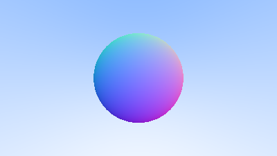  

## 6.2 简化射线-球体交汇代码
让我们重新审视一下射线球体方程：

```cpp
double hit_sphere(const point3& center, double radius, const ray& r) {
    vec3 oc = r.origin() - center;
    auto a = dot(r.direction(), r.direction());
    auto b = 2.0 * dot(oc, r.direction());
    auto c = dot(oc, oc) - radius*radius;
    auto discriminant = b*b - 4*a*c;

    if (discriminant < 0) {
        return -1.0;
    } else {
        return (-b - sqrt(discriminant) ) / (2.0*a);
    }
}
```
> [main.cc] Ray-sphere intersection code (before)

首先，回顾一下，与自身点乘的向量等于该向量的平方长度。

其次，注意`b`的方程中如何有一个2的因子。考虑一下，如果 $b=2h$，二次方程会发生什么:

$$ \frac{−b± \sqrt{b^2−4ac}}{2a}$$
$$ =\frac{−2h± \sqrt{(2h)^2−4ac}}{2a}$$
$$ =\frac{−2h± 2\sqrt{h^2−ac}}{2a}$$
$$ =\frac{−h± \sqrt{h^2−ac}}{a}$$

利用这些观察，我们现在可以将球体相交的代码简化为这样:
```cpp
double hit_sphere(const point3& center, double radius, const ray& r) {
    vec3 oc = r.origin() - center;
    auto a = r.direction().length_squared();
    auto half_b = dot(oc, r.direction());
    auto c = oc.length_squared() - radius*radius;
    auto discriminant = half_b*half_b - a*c;

    if (discriminant < 0) {
        return -1.0;
    } else {
        return (-half_b - sqrt(discriminant) ) / a;
    }
}
```
>[main.cc] Ray-sphere intersection code (after)

<br/>

## 6.3. 可击中对象的抽象
现在，如果有多个球体会如何呢？虽然有一个球体数组是很诱人的，但一个非常干净的解决方案是为射线可能击中的任何东西建立一个 "抽象类"，并使球体和球体列表都只是你可以击中的东西。这个类应该叫什么是个难题--如果不是为了 "面向对象 "编程，叫它 "对象"也不错。

"Surface"经常被使用，其弱点是也许我们会想要体积。"hittable"强调了将它们联合起来的成员函数。我不喜欢其中任何一个，但我会选择 "hittable"。

这个hittable抽象类将有一个接收射线的hit函数。对大多数射线追踪器来说，为命中添加一个有效的区间$t_{min}$到$t_{max}$是很方便的，所以只有当$t_{min}<t<t_{max}$ 时，命中才 "算数"。

对于初始射线来说，这是正的 $t$，但是正如我们将看到的，在代码中，有一个 $t_{min}$到$t_{max}$的区间可以帮助一些细节。一个设计上的问题是，是否要做一些事情，比如在我们撞到什么东西的时候计算法线。我们可能会在搜索过程中遇到更近的东西，而我们只需要最近的东西的法线。我将采用简单的解决方案，计算一束东西，并将其存储在某个结构中。

这里是抽象类：
```cpp
#ifndef HITTABLE_H
#define HITTABLE_H

#include "ray.h"

struct hit_record {
    point3 p;
    vec3 normal;
    double t;
};

class hittable {
    public:
        virtual bool hit(const ray& r, double t_min, double t_max, hit_record& rec) const = 0;
};

#endif
```
>[hittable.h] The hittable class

这是球体:
```cpp
#ifndef SPHERE_H
#define SPHERE_H

#include "hittable.h"
#include "vec3.h"

class sphere : public hittable {
    public:
        sphere() {}
        sphere(point3 cen, double r) : center(cen), radius(r) {};

        virtual bool hit(
            const ray& r, double t_min, double t_max, hit_record& rec) const override;

    public:
        point3 center;
        double radius;
};

bool sphere::hit(const ray& r, double t_min, double t_max, hit_record& rec) const {
    vec3 oc = r.origin() - center;
    auto a = r.direction().length_squared();
    auto half_b = dot(oc, r.direction());
    auto c = oc.length_squared() - radius*radius;

    auto discriminant = half_b*half_b - a*c;
    if (discriminant < 0) return false;
    auto sqrtd = sqrt(discriminant);

    // Find the nearest root that lies in the acceptable range.
    auto root = (-half_b - sqrtd) / a;
    if (root < t_min || t_max < root) {
        root = (-half_b + sqrtd) / a;
        if (root < t_min || t_max < root)
            return false;
    }

    rec.t = root;
    rec.p = r.at(rec.t);
    rec.normal = (rec.p - center) / radius;

    return true;
}

#endif
```
>[sphere.h] The sphere class

## 6.4. 正面与反面的对比
法线的第二个设计决定是它们是否应该总是指向外面。目前，发现的法线将总是沿着中心到交点的方向（法线指向外）。

如果射线从外面与球体相交，法线就会指向射线。

如果射线从内部与球体相交，则法线（总是指向外部）顺着射线。

或者，我们也可以让法线始终指向射线。如果射线在球体外，法线将指向外侧，但如果射线在球体内，法线将指向内侧。

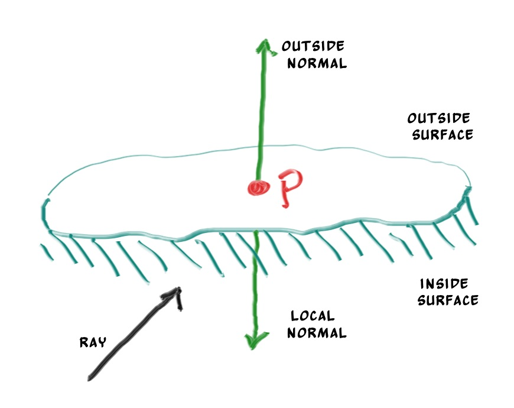  
>Possible directions for sphere surface-normal geometry

我们需要在这些中选择一个，因为我们最终会想确定射线来自表面的哪一面。这对于每一面的渲染都不同的物体来说是很重要的，比如一张双面纸上的文字，或者对于有内部和外部的物体，比如玻璃球。

如果我们决定让法线总是指向外面，那么我们就需要在给射线着色时确定它在哪一边。我们可以通过比较射线和法线来确定这一点。如果射线和法线的方向相同，那么射线就在物体内部，如果射线和法线的方向相反，那么射线就在物体外部。这可以通过取两个向量的点积来确定，如果它们的点积是正的，则射线在球体内部。
```cpp
if (dot(ray_direction, outward_normal) > 0.0) {
    // ray is inside the sphere
    ...
} else {
    // ray is outside the sphere
    ...
}
```
>Comparing the ray and the normal

<br/>
如果我们决定让法线总是指向射线，我们就不能用点积来确定射线在曲面的哪一边。相反，我们需要存储这些信息。


```cpp
bool front_face;
if (dot(ray_direction, outward_normal) > 0.0) {
    // ray is inside the sphere
    normal = -outward_normal;
    front_face = false;
} else {
    // ray is outside the sphere
    normal = outward_normal;
    front_face = true;
}
```
>Remembering the side of the surface

<br/>

我们可以设置成法线总是指向曲面的 "外侧"，或者总是指向入射光线。这个决定取决于你是想在几何体相交时还是在着色时确定曲面的边。在本书中，我们有更多的材质类型，而不是几何体类型，所以我们会选择在几何体上进行判断，以减少工作量。这只是一个偏好的问题，你会在文献中看到两种实现方式。

我们在`hit_record`结构中加入`front_face bool`。我们还将添加一个函数来为我们解决这个计算。

```cpp
struct hit_record {
    point3 p;
    vec3 normal;
    double t;
    bool front_face;

    inline void set_face_normal(const ray& r, const vec3& outward_normal) {
        front_face = dot(r.direction(), outward_normal) < 0;
        normal = front_face ? outward_normal :-outward_normal;
    }
};
```
>[hittable.h] Adding front-face tracking to hit_record

然后我们把表面的确定结果添加到类中。
```cpp
bool sphere::hit(const ray& r, double t_min, double t_max, hit_record& rec) const {
    ...

    rec.t = root;
    rec.p = r.at(rec.t);
    vec3 outward_normal = (rec.p - center) / radius;
    rec.set_face_normal(r, outward_normal);

    return true;
}
```

>[sphere.h] The sphere class with normal determination

##6.5. 可击中物体的列表

我们有一个叫做hittable的通用对象，射线可以与之相交。我们现在添加一个类，用来存储一个hittable的列表：

```cpp
#ifndef HITTABLE_LIST_H
#define HITTABLE_LIST_H

#include "hittable.h"

#include <memory>
#include <vector>

using std::shared_ptr;
using std::make_shared;

class hittable_list : public hittable {
    public:
        hittable_list() {}
        hittable_list(shared_ptr<hittable> object) { add(object); }

        void clear() { objects.clear(); }
        void add(shared_ptr<hittable> object) { objects.push_back(object); }

        virtual bool hit(
            const ray& r, double t_min, double t_max, hit_record& rec) const override;

    public:
        std::vector<shared_ptr<hittable>> objects;
};

bool hittable_list::hit(const ray& r, double t_min, double t_max, hit_record& rec) const {
    hit_record temp_rec;
    bool hit_anything = false;
    auto closest_so_far = t_max;

    for (const auto& object : objects) {
        if (object->hit(r, t_min, closest_so_far, temp_rec)) {
            hit_anything = true;
            closest_so_far = temp_rec.t;
            rec = temp_rec;
        }
    }

    return hit_anything;
}

#endif
```
>[hittable_list.h] The hittable_list class


## 6.6. 一些新的C++特性
`hittable_list`类的代码使用了两个C++特性，如果你通常不是C++程序员，可能会被绊倒：`vector`和`shared_ptr`。

`shared_ptr<type>`是一个指向某种分配类型的指针，具有引用计数的语义。每当你把它的值赋给另一个共享指针（通常是用一个简单的赋值），引用计数就会增加。当共享指针超出范围时（比如在一个块或函数的末尾），引用计数被递减。一旦计数为零，该对象就被删除。

通常情况下，共享指针首先用一个新分配的对象进行初始化，类似这样。
```cpp
shared_ptr<double> double_ptr = make_shared<double>(0.37);
shared_ptr<vec3>   vec3_ptr   = make_shared<vec3>(1.414214, 2.718281, 1.618034);
shared_ptr<sphere> sphere_ptr = make_shared<sphere>(point3(0,0,0), 1.0);
```
>一个使用shared_ptr的分配例子

<br/>

`make_shared<thing>(thing_constructor_params ...)` 使用构造函数参数分配一个新的 `thing` 类型实例。它返回一个 `shared_ptr<thing>`。

由于类型可以通过 `make_shared<type>(...)` 的返回类型自动推导出来，上面几行可以使用 C++ 的自动类型指定器更简单地表达。

```cpp
auto double_ptr = make_shared<double>(0.37);
auto vec3_ptr   = make_shared<vec3>(1.414214, 2.718281, 1.618034);
auto sphere_ptr = make_shared<sphere>(point3(0,0,0), 1.0);
```
> 一个使用自动类型的shared_ptr的分配例子

<br/>

我们将在我们的代码中使用共享指针，因为它允许多个几何体共享一个共同的实例（例如，一群球体都使用相同的纹理贴图材料），并且因为它使内存管理自动化，更容易推理。

`std::shared_ptr`被包含在`<memory>`头中。

你可能不熟悉的第二个C++特性是`std::vector`。这是一个任意类型的类似数组的通用集合。上面，我们使用了一个指向`hittable`的集合。`std::vector`会随着更多值的加入而自动增长：`objects.push_back(object)`将一个值添加到`std::vector`成员变量`objects`的结尾。

`std::vector`被包含在`<vector>`头文件中。

最后，清单20中的using语句告诉编译器，我们将从std库中获得`shared_ptr和make_shared`，所以我们不需要每次引用它们时都用`std::`来预置这些。

## 6.7. 常用常数和实用函数

我们需要一些数学常数，我们在自己的头文件中方便地定义这些常数。现在我们只需要无穷大，但我们也会把我们自己对π的定义放在里面，我们以后会需要。圆周率没有标准的可移植定义，所以我们只是定义我们自己的常数。我们将在`rtweekend.h`，也就是我们的主头文件中抛出常用的有用常数和未来的实用函数。


```cpp
#ifndef RTWEEKEND_H
#define RTWEEKEND_H

#include <cmath>
#include <limits>
#include <memory>


// Usings

using std::shared_ptr;
using std::make_shared;
using std::sqrt;

// Constants

const double infinity = std::numeric_limits<double>::infinity();
const double pi = 3.1415926535897932385;

// Utility Functions

inline double degrees_to_radians(double degrees) {
    return degrees * pi / 180.0;
}

// Common Headers

#include "ray.h"
#include "vec3.h"

#endif
```
>[rtweekend.h] The rtweekend.h common header

<br/>


然后是新的主函数main:
```cpp
#include "rtweekend.h"

#include "color.h"
#include "hittable_list.h"
#include "sphere.h"

#include <iostream>
color ray_color(const ray& r, const hittable& world) {
    hit_record rec;
    if (world.hit(r, 0, infinity, rec)) {
        return 0.5 * (rec.normal + color(1,1,1));
    }
    vec3 unit_direction = unit_vector(r.direction());
    auto t = 0.5*(unit_direction.y() + 1.0);
    return (1.0-t)*color(1.0, 1.0, 1.0) + t*color(0.5, 0.7, 1.0);
}

int main() {

    // Image

    const auto aspect_ratio = 16.0 / 9.0;
    const int image_width = 400;
    const int image_height = static_cast<int>(image_width / aspect_ratio);

    // World
    hittable_list world;
    world.add(make_shared<sphere>(point3(0,0,-1), 0.5));
    world.add(make_shared<sphere>(point3(0,-100.5,-1), 100));

    // Camera

    auto viewport_height = 2.0;
    auto viewport_width = aspect_ratio * viewport_height;
    auto focal_length = 1.0;

    auto origin = point3(0, 0, 0);
    auto horizontal = vec3(viewport_width, 0, 0);
    auto vertical = vec3(0, viewport_height, 0);
    auto lower_left_corner = origin - horizontal/2 - vertical/2 - vec3(0, 0, focal_length);

    // Render

    std::cout << "P3\n" << image_width << ' ' << image_height << "\n255\n";

    for (int j = image_height-1; j >= 0; --j) {
        std::cerr << "\rScanlines remaining: " << j << ' ' << std::flush;
        for (int i = 0; i < image_width; ++i) {
            auto u = double(i) / (image_width-1);
            auto v = double(j) / (image_height-1);
            ray r(origin, lower_left_corner + u*horizontal + v*vertical);
            color pixel_color = ray_color(r, world);
            write_color(std::cout, pixel_color);
        }
    }

    std::cerr << "\nDone.\n";
}
```
>Listing 24: [main.cc] 使用hittables的新的main函数

<br/>


这就产生了一张图片，实际上只是球体的位置和它们的表面法线的可视化。这通常是观察你的模型是否有缺陷和特点的一个好方法。


# 7. 抗锯齿

当真正的相机拍摄照片时，通常不会出现边缘锯齿，因为边缘像素是一些前景和一些背景的混合。我们可以通过对每个像素内的一堆样本进行平均化来获得同样的效果。我们不会去管分层的问题。这是有争议的，但对我的程序来说是通常的。对于某些光线追踪器来说，这很关键，但我们正在编写的这种一般的光线追踪器并没有从中受益，而且它使代码更难看。我们对相机类做了一些抽象，这样我们以后就可以做一个更酷的相机。

## 7.1 一些随机数实用工具
我们需要的一件事是一个返回实数的随机数发生器。我们需要一个函数来返回一个典型的随机数，按照惯例，该函数会返回一个范围为 $0≤r<1$ 的随机实数。 $1$ 前面的 "小于 "很重要，因为我们有时会利用这一点。

一个简单的方法是使用`<cstdlib>`中的`rand()`函数。这个函数返回一个范围为`0`和`RAND_MAX`的随机整数。因此，我们可以通过添加到`rtweekend.h`中的以下代码片断，如愿得到一个真实的随机数。

```cpp
#include <cstdlib>
...

inline double random_double() {
    // Returns a random real in [0,1).
    return rand() / (RAND_MAX + 1.0);
}

inline double random_double(double min, double max) {
    // Returns a random real in [min,max).
    return min + (max-min)*random_double();
}
```
>Listing 25: [rtweekend.h] random_double() functions

<br/>


传统上，C++没有标准的随机数生成器，但较新版本的C++已经通过`<random>`头解决了这个问题（尽管据一些专家说并不完美）。如果你想使用这个，你可以获得一个具有我们需要的条件的随机数，如下所示。

```cpp
#include <random>

inline double random_double() {
    static std::uniform_real_distribution<double> distribution(0.0, 1.0);
    static std::mt19937 generator;
    return distribution(generator);
}
```
>Listing 26: [rtweekend.h] random_double(), alternate implemenation

<br/>

# 7.2. 用多个样本生成像素
对于一个给定的像素，我们在该像素内有几个样本，并通过每个样本发送射线。然后对这些光线的颜色进行平均化。

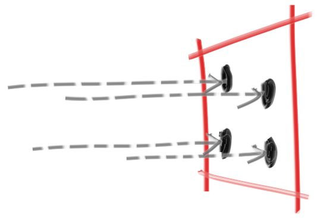  

现在是创建一个相机类的好时机，以管理我们的虚拟相机和相关的场景取样任务。下面的类使用之前的轴对齐相机实现了一个简单的相机。

```cpp
#ifndef CAMERA_H
#define CAMERA_H

#include "rtweekend.h"

class camera {
    public:
        camera() {
            auto aspect_ratio = 16.0 / 9.0;
            auto viewport_height = 2.0;
            auto viewport_width = aspect_ratio * viewport_height;
            auto focal_length = 1.0;

            origin = point3(0, 0, 0);
            horizontal = vec3(viewport_width, 0.0, 0.0);
            vertical = vec3(0.0, viewport_height, 0.0);
            lower_left_corner = origin - horizontal/2 - vertical/2 - vec3(0, 0, focal_length);
        }

        ray get_ray(double u, double v) const {
            return ray(origin, lower_left_corner + u*horizontal + v*vertical - origin);
        }

    private:
        point3 origin;
        point3 lower_left_corner;
        vec3 horizontal;
        vec3 vertical;
};
#endif
```
>Listing 27: [camera.h] The camera class

<br/>

为了`处理多采样`的颜色计算，我们将更新color中的`write_color()`函数。

与其在每次积累更多的光照时加入一个小数贡献，不如在每次迭代时加入完整的颜色，然后在写出颜色时在最后进行一次除法（按样本数）。

此外，我们将在`rtweekend.h`工具头中添加一个方便的实用函数： `clamp(x,min,max)`，它将值 `x` 控制在`[min,max]`范围内。

```cpp
inline double clamp(double x, double min, double max) {
    if (x < min) return min;
    if (x > max) return max;
    return x;
}
```
>Listing 28: [rtweekend.h] The clamp() utility function

<br/>

```cpp
void write_color(std::ostream &out, color pixel_color, int samples_per_pixel) {
    auto r = pixel_color.x();
    auto g = pixel_color.y();
    auto b = pixel_color.z();

    // Divide the color by the number of samples.
    auto scale = 1.0 / samples_per_pixel;
    r *= scale;
    g *= scale;
    b *= scale;

    // Write the translated [0,255] value of each color component.
    out << static_cast<int>(256 * clamp(r, 0.0, 0.999)) << ' '
        << static_cast<int>(256 * clamp(g, 0.0, 0.999)) << ' '
        << static_cast<int>(256 * clamp(b, 0.0, 0.999)) << '\n';
}
```
>Listing 29: [color.h] The multi-sample write_color() function

<br/>

main函数也改变了：
```cpp
#include "camera.h"

...

int main() {

    // Image

    const auto aspect_ratio = 16.0 / 9.0;
    const int image_width = 400;
    const int image_height = static_cast<int>(image_width / aspect_ratio);
    const int samples_per_pixel = 100;

    // World

    hittable_list world;
    world.add(make_shared<sphere>(point3(0,0,-1), 0.5));
    world.add(make_shared<sphere>(point3(0,-100.5,-1), 100));

    // Camera
    camera cam;

    // Render

    std::cout << "P3\n" << image_width << " " << image_height << "\n255\n";

    for (int j = image_height-1; j >= 0; --j) {
        std::cerr << "\rScanlines remaining: " << j << ' ' << std::flush;
        for (int i = 0; i < image_width; ++i) {
            color pixel_color(0, 0, 0);
            for (int s = 0; s < samples_per_pixel; ++s) {
                auto u = (i + random_double()) / (image_width-1);
                auto v = (j + random_double()) / (image_height-1);
                ray r = cam.get_ray(u, v);
                pixel_color += ray_color(r, world);
            }
            write_color(std::cout, pixel_color, samples_per_pixel);
        }
    }

    std::cerr << "\nDone.\n";
}
```
>Listing 30: [main.cc] Rendering with multi-sampled pixels

<br/>

放大产生的图像，我们可以看到边缘像素的差异。

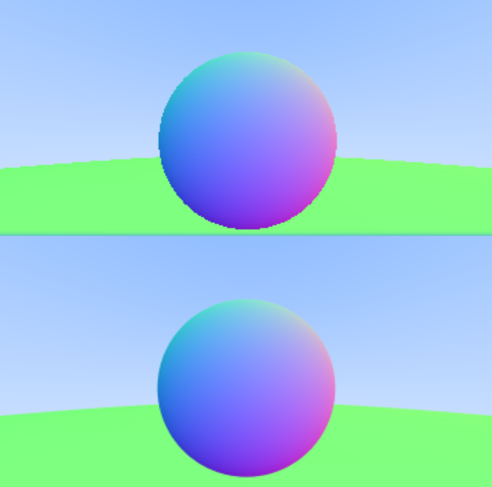  


# 8. 漫反射材质
现在我们有了物体和每个像素的多条射线，我们可以制作一些看起来很真实的材质。我们将从漫反射（哑光）材质开始。有一个问题是，我们是混合匹配几何体和材质（所以我们可以将一个材质分配给多个球体，反之亦然），还是将几何体和材质紧密结合起来（这对于几何体和材质相连的程序对象来说可能很有用）。我们将采用分离的方式--这在大多数渲染器中是很常见的--但要注意到这个限制。


## 8.1. 一个简单的漫反射材质
不发光的漫射物体只是吸收了周围环境的颜色，但它们用自己固有的颜色对其进行调制。从漫射表面反射出来的光，其方向是随机的。因此，如果我们将三条光线送入两个漫反射表面之间的裂缝，它们将各自有不同的随机行为。

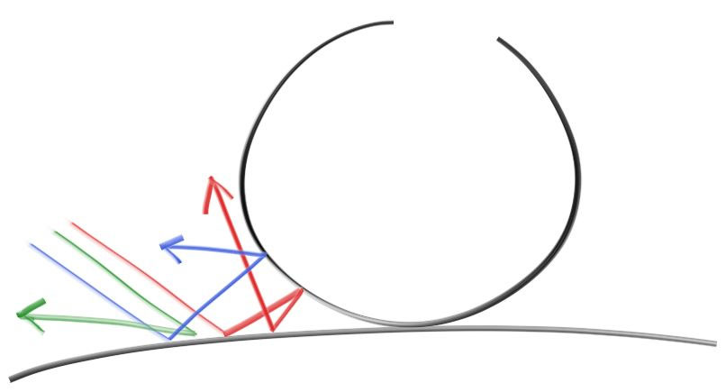  

它们也可能被吸收而不是反射。表面越黑，就越有可能被吸收。(这就是为什么它是黑暗的！）实际上，任何随机化方向的算法都会产生看起来是粗糙的表面。其中一个最简单的方法被证明对理想的漫反射表面是完全正确的。(我曾经作为一个懒惰的黑客来做的在数学上接近理想的兰伯斯。)

(读者Vassillen Chizhov证明了这个懒惰的黑客确实只是一个懒惰的黑客，是不准确的）。理想Lambertian的正确表示方法并不费力，在本章的末尾会介绍）。

有两个单位半径的球体与一个表面的命中点 $p$ 相切。这两个球体的中心分别是 $(P+n)$ 和 $(P-n)$，其中 $n$ 是表面的法线。中心在 $(P-n)$ 的球体被认为在曲面内，而中心在 $(P+n)$ 的球体被认为在曲面外。选择切线单位半径的球体，该球体与射线原点在曲面的同一侧。在这个单位半径的球体内选一个随机点 $S$，然后从命中点 $P$ 发送一条射线到随机点 $S$ （这就是矢量 $(S-P)$）。

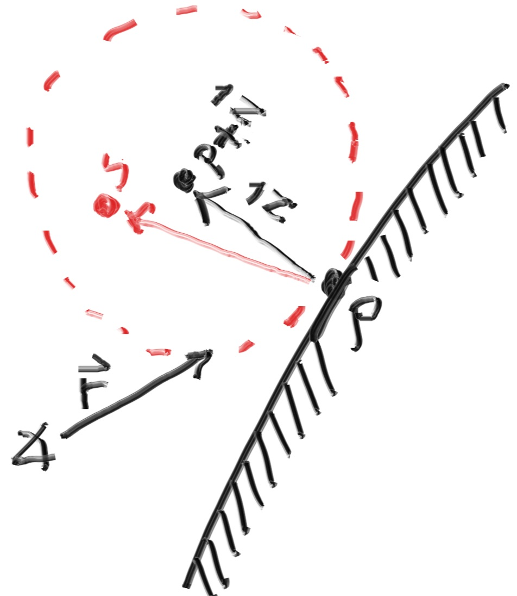  

我们需要一种方法在一个单位半径的球体中挑选一个随机点。我们将使用通常最简单的算法：拒绝法。首先，在单位立方体中挑选一个随机点，其中x、y和z都在-1到+1之间。如果这个点在球体之外，拒绝这个点，再试一次。


```cpp
class vec3 {
  public:
    ...
    inline static vec3 random() {
        return vec3(random_double(), random_double(), random_double());
    }

    inline static vec3 random(double min, double max) {
        return vec3(random_double(min,max), random_double(min,max), random_double(min,max));
    }
}
```
>[vec3.h] vec3 random utility functions

```cpp
vec3 random_in_unit_sphere() {
    while (true) {
        auto p = vec3::random(-1,1);
        if (p.length_squared() >= 1) continue;
        return p;
    }
}
```
>[vec3.h] The random_in_unit_sphere() function

<br/>

然后更新`ray_color()`函数以使用新的随机方向发生器。

```cpp
color ray_color(const ray& r, const hittable& world) {
    hit_record rec;

    if (world.hit(r, 0, infinity, rec)) {
        point3 target = rec.p + rec.normal + random_in_unit_sphere();
        return 0.5 * ray_color(ray(rec.p, target - rec.p), world);
    }

    vec3 unit_direction = unit_vector(r.direction());
    auto t = 0.5*(unit_direction.y() + 1.0);
    return (1.0-t)*color(1.0, 1.0, 1.0) + t*color(0.5, 0.7, 1.0);
}
```

>Listing 33: [main.cc] ray_color() using a random ray direction

# 8.2. 限制子射线的数量
这里潜伏着一个潜在的问题。请注意，ray_color函数是递归的。它什么时候会停止递归？当它未能击中任何东西时。然而，在某些情况下，这可能是一个很长的时间--长到足以让堆栈爆炸。为了防止这种情况，让我们限制最大的递归深度，在最大深度时不返回任何光线贡献。

```cpp
color ray_color(const ray& r, const hittable& world, int depth) {
    hit_record rec;

    // If we've exceeded the ray bounce limit, no more light is gathered.
    if (depth <= 0)
        return color(0,0,0);

    if (world.hit(r, 0, infinity, rec)) {
        point3 target = rec.p + rec.normal + random_in_unit_sphere();
        return 0.5 * ray_color(ray(rec.p, target - rec.p), world, depth-1);
    }

    vec3 unit_direction = unit_vector(r.direction());
    auto t = 0.5*(unit_direction.y() + 1.0);
    return (1.0-t)*color(1.0, 1.0, 1.0) + t*color(0.5, 0.7, 1.0);
}

...

int main() {

    // Image

    const auto aspect_ratio = 16.0 / 9.0;
    const int image_width = 400;
    const int image_height = static_cast<int>(image_width / aspect_ratio);
    const int samples_per_pixel = 100;
    const int max_depth = 50;
    ...

    // Render

    std::cout << "P3\n" << image_width << " " << image_height << "\n255\n";

    for (int j = image_height-1; j >= 0; --j) {
        std::cerr << "\rScanlines remaining: " << j << ' ' << std::flush;
        for (int i = 0; i < image_width; ++i) {
            color pixel_color(0, 0, 0);
            for (int s = 0; s < samples_per_pixel; ++s) {
                auto u = (i + random_double()) / (image_width-1);
                auto v = (j + random_double()) / (image_height-1);
                ray r = cam.get_ray(u, v);
                pixel_color += ray_color(r, world, max_depth);
            }
            write_color(std::cout, pixel_color, samples_per_pixel);
        }
    }

    std::cerr << "\nDone.\n";
}
```

>Listing 34: [main.cc] ray_color() with depth limiting

最终：

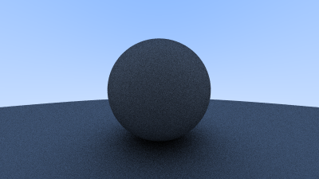  

## 8.3. 使用伽玛校正以获得准确的色彩强度
注意球体下面的阴影。这张图片非常暗，但我们的球体在每次反弹时只吸收一半的能量，所以它们是50%的反射器。如果你看不到阴影，不用担心，我们现在就可以解决这个问题。这些球体看起来应该很浅（在现实生活中，是浅灰色）。其原因是，几乎所有的图像查看器都假定图像是 "伽马校正 "的，这意味着0到1的值在被存储为字节之前有一些转换。这有很多很好的理由，但对于我们的目的来说，我们只需要注意到这一点。

初步估计，我们可以使用 "gamma 2"，这意味着将颜色提高到 $1/gamma$ 的幂数，或者在我们的简单案例中是 $½$ ，也就是平方根。

```cpp
void write_color(std::ostream &out, color pixel_color, int samples_per_pixel) {
    auto r = pixel_color.x();
    auto g = pixel_color.y();
    auto b = pixel_color.z();

    // Divide the color by the number of samples and gamma-correct for gamma=2.0.
    auto scale = 1.0 / samples_per_pixel;
    r = sqrt(scale * r);
    g = sqrt(scale * g);
    b = sqrt(scale * b);

    // Write the translated [0,255] value of each color component.
    out << static_cast<int>(256 * clamp(r, 0.0, 0.999)) << ' '
        << static_cast<int>(256 * clamp(g, 0.0, 0.999)) << ' '
        << static_cast<int>(256 * clamp(b, 0.0, 0.999)) << '\n';
}
```

> Listing 35: [color.h] write_color(), with gamma correction

这产生了浅灰色，正如我们所希望的：

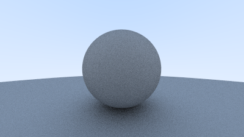  


## 8.4. 修复阴影痤疮

这里面还有一个微妙的错误。

一些反射光线不是在 $t=0$ 时击中它们所反射的物体，而是在 $t=-0.0000001$ 或 $t=0.00000001$ 或球体间隔给我们的任何浮点近似值。

所以我们需要`忽略非常接近零的hit`。


```cpp
if (world.hit(r, 0.001, infinity, rec)) {
```

>Listing 36: [main.cc] Calculating reflected ray origins with tolerance

这就摆脱了阴影痤疮问题。是的，它真的叫这个名字。

## 8.5. 真正的兰伯斯反射

这里提出的剔除方法在单位球中产生沿表面法线偏移的随机点。这相当于在半球上挑选出接近法线的高概率方向，而在掠过角度散射射线的概率较低。

这种分布的尺度是 $cos^3(\phi)$，其中 $\phi$ 是与法线的角度。这很有用，因为以浅角到达的光线在更大的范围内传播，因此对最终颜色的贡献较低。

然而，我们感兴趣的是Lambertian分布，它的分布是 $cos^3(\phi)$。真正的Lambertian对于接近正态的射线散射来说，其概率更高，但分布更均匀。这是通过在单位球体的表面上选取随机点，沿表面法线偏移来实现的。

在单位球面上选取随机点可以通过在单位球面上选取随机点，然后将这些点归一化来实现。

```cpp
vec3 random_unit_vector() {
    return unit_vector(random_in_unit_sphere());
}
```
>Listing 37: [vec3.h] The random_unit_vector() function

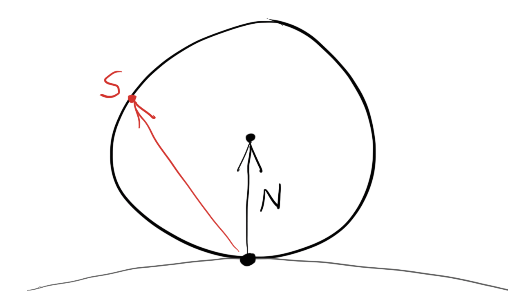  

>生成一个随机的单位向量

这个`random_unit_vector()`函数是现有的`random_in_unit_sphere()`函数的直接替换。

```cpp
color ray_color(const ray& r, const hittable& world, int depth) {
    hit_record rec;

    // If we've exceeded the ray bounce limit, no more light is gathered.
    if (depth <= 0)
        return color(0,0,0);

    if (world.hit(r, 0.001, infinity, rec)) {
        point3 target = rec.p + rec.normal + random_unit_vector();
        return 0.5 * ray_color(ray(rec.p, target - rec.p), world, depth-1);
    }

    vec3 unit_direction = unit_vector(r.direction());
    auto t = 0.5*(unit_direction.y() + 1.0);
    return (1.0-t)*color(1.0, 1.0, 1.0) + t*color(0.5, 0.7, 1.0);
}
```
>Listing 38: [main.cc] 替换漫反射的ray_color()

渲染后，我们得到一个类似的图像， 阴影部位和原来比变淡了：

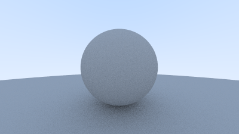  

鉴于我们的两个球体的场景非常简单，很难说出这两种漫反射方法之间的区别，但你应该能够注意到两个重要的视觉差异。

1. 改变后的阴影不那么明显了
2. 改变后，两个球体的外观都变亮了

这两种变化都是由于光线的散射更加均匀，向法线方向散射的光线更少。这意味着对于漫反射物体来说，它们会显得更亮，因为有更多的光线反弹到相机上。对于阴影来说，较少的光线直接向上反弹，所以大球体在小球体正下方的部分会更亮。

## 8.6. 一种替代性的漫反射方案

本书中介绍的最初的hack持续了很长时间，才被证明是对理想的兰伯斯漫反射的不正确的近似。这个错误持续了这么久的一个重要原因是，很难去：

1. 从数学上证明概率分布是不正确的
2. 直观地解释为什么 $cos(\phi)$ 分布是可取的（以及它看起来像什么）。


并非很多常见的、日常的物体都是完全漫射的，所以我们对这些物体在光线下的行为的视觉直觉可能很差。

为了便于学习，我们引入了一个直观的、易于理解的漫反射方法。对于上面的两种方法，我们有一个随机矢量，先是随机长度，然后是单位长度，从命中点偏移法线。为什么向量要被法线偏移，这可能不是很明显。

一个更直观的方法是，在远离击中点的所有角度都有一个统一的散射方向，而不依赖于与法线的角度。许多最早的光线追踪论文都使用了这种漫射方法（在采用兰伯斯漫反射之前）。

```cpp
vec3 random_in_hemisphere(const vec3& normal) {
    vec3 in_unit_sphere = random_in_unit_sphere();
    if (dot(in_unit_sphere, normal) > 0.0) // In the same hemisphere as the normal
        return in_unit_sphere;
    else
        return -in_unit_sphere;
}
```
>Listing 39: [vec3.h] The random_in_hemisphere(normal) function

将新的公式插入`ray_color()`函数中:

```cpp
color ray_color(const ray& r, const hittable& world, int depth) {
    hit_record rec;

    // If we've exceeded the ray bounce limit, no more light is gathered.
    if (depth <= 0)
        return color(0,0,0);

    if (world.hit(r, 0.001, infinity, rec)) {
        point3 target = rec.p + random_in_hemisphere(rec.normal);
        return 0.5 * ray_color(ray(rec.p, target - rec.p), world, depth-1);
    }

    vec3 unit_direction = unit_vector(r.direction());
    auto t = 0.5*(unit_direction.y() + 1.0);
    return (1.0-t)*color(1.0, 1.0, 1.0) + t*color(0.5, 0.7, 1.0);
}
```
>Listing 40: [main.cc] ray_color() with hemispherical scattering

给了我们以下图像:
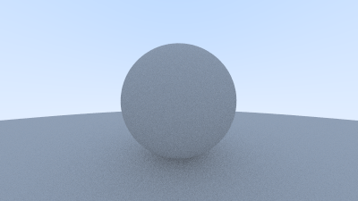  
>具有半球形散射的漫反射球体的渲染

在本书的过程中，场景将变得更加复杂。我们鼓励你在这里介绍的不同漫反射渲染器之间进行切换。大多数感兴趣的场景都会包含过多的漫反射材料。通过了解不同漫反射方法对场景照明的影响，你可以获得宝贵的见解。


# 9. 金属

## 9.1 材质抽象类